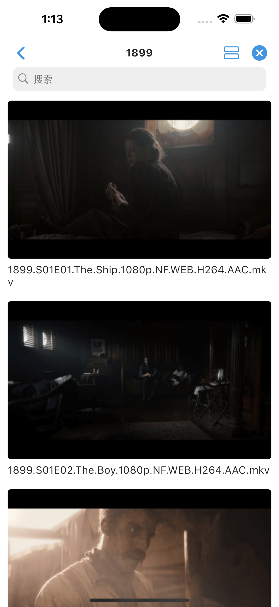
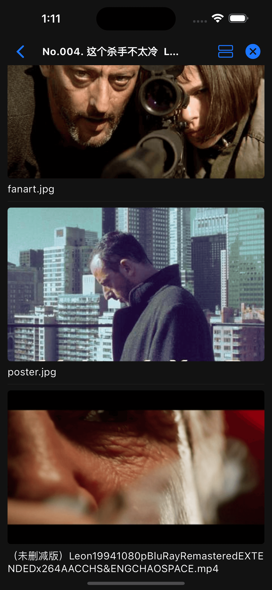

# 封面视图

封面视图可以用来展示更大的图片内容, 类似于 Youtube 的列表页。

仅加载 `Object.cover` 字段不为空的对象。

```javascript
class CoverLayout extends Deup {
  config = {
    name: '封面视图',
    layout: 'cover', // 设置默认封面视图
  };
}
```

{ width="200" } { width="200" } { width="200" }
