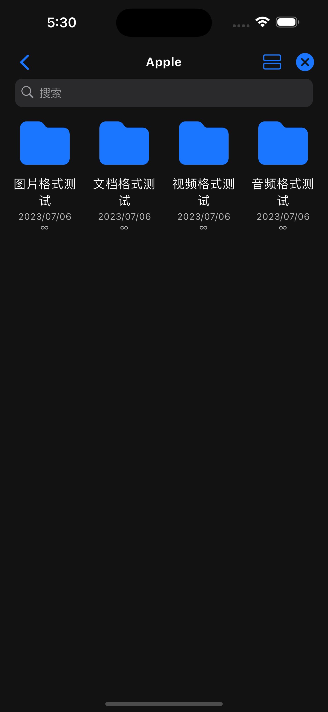

# 网格视图

网格视图可以展示全部类型的数据, 可以设置默认视图为网格视图, 也可以在单个页面切换视图。

```javascript
class GridLayout extends Deup {
  config = {
    name: '网格视图',
    layout: 'grid', // 设置默认视图为网格
  };
}
```

{ width="200" } { width="200" } { width="200" }
