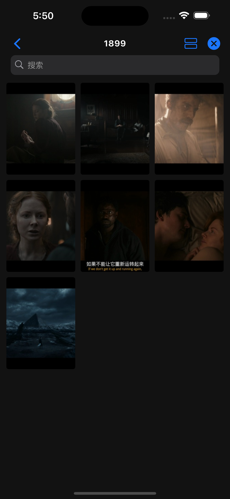

# 海报视图

海报视图普遍用于展示影视频作品的海报，更好的展示文件信息。

仅加载 `Object.poster` 字段不为空的对象。

```javascript
class PosterLayout extends Deup {
  config = {
    name: '海报视图',
    layout: 'poster', // 设置默认视图为海报
  };
}
```

{ width="200" } { width="200" } { width="200" }
