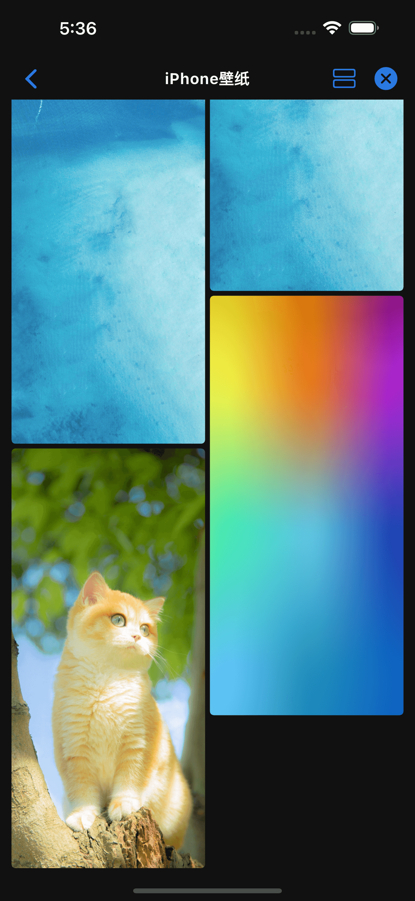

# 图片视图

图片视图仅展示图片类型的数据, 使用双列瀑布流的方式展示。

图片会加载 `Object.url` 字段链接, 如果该字段为空, 会尝试调用 `Deup.get` 方法来获取具体文件的详细信息。

PS: 不要使用超高分辨率的图片, 可能会导致程序 OOM。

```javascript
class ImageLayout extends Deup {
  config = {
    name: '图片视图',
    layout: 'image', // 设置默认视图为图片
  };
}
```

{ width="200" } { width="200" } { width="200" }
