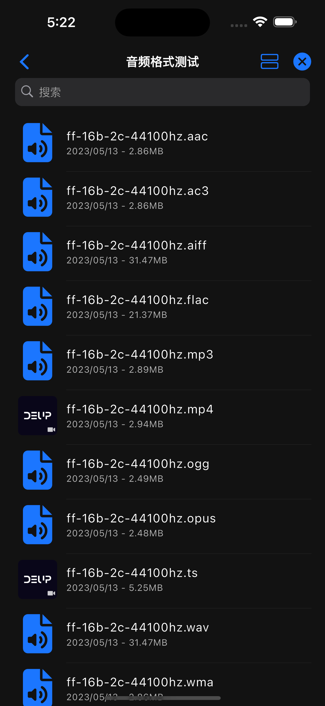
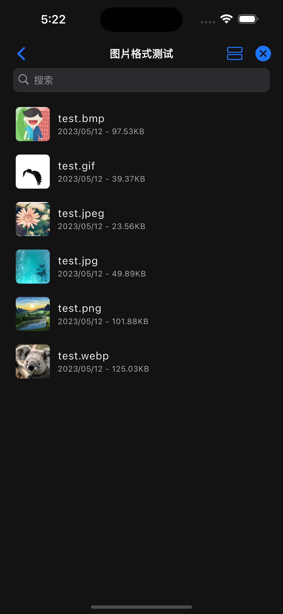

# 列表视图

列表视图可以展示全部类型的数据, 默认视图为列表视图, 无需特殊配置.

```javascript
class ListLayout extends Deup {
  config = {
    name: '列表视图',
    layout: 'list', // 设置默认视图为列表
  };
}
```

{ width="200" } { width="200" } { width="200" }
